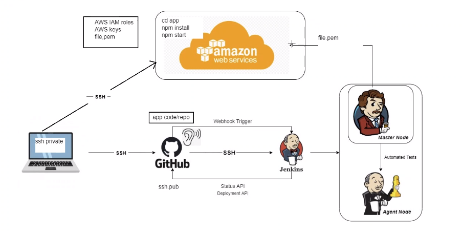

## Navigating Jenkins

#### Creating a job: (Test)
1. Click **New Item**
2. Enter a suitable name: `wafa-first-job`
3. Scroll down and click **OK**
4. Write a description (can be anything suitable)
5. Select **Discard old builds**
6. Scroll down to **Build** and write commands:
```commandline
whoami
uname -a
```
or
```commandline
date
```
7. click **Save**

## Understanding what we're doing

1. Starts on local machine
2. SSH link to GitHub
3. There is a webhook that is listening Constantly. When webhook triggers, code sent to jenkins
NOTE: There are different branches alongside the Main brain where we can test code without breaking the Main code.
5. Jenkins tests code and confirms whether is has successfully run or failed
6. If the tests have passed on Jenkins, it will be merged to the main branch (in our case)

## CI (Continuous Integration)
### Task 1: Linking 2 jobs together/Merging dev to main

#### Creating first job
1. Click Create new Job/New Item 
2. label 'wafa-CI' (second job)
3. Click 'Freestyle Project'
4. Description - suitable description
5. Tick **Discard Old Builds**
6. Max # of builds to keep = 3
7. Tick GitHub project > paste repository URL `https://github.com/WafaMohbubul/CI_CD`
7. Restrict where this project can be run = sparta-ubuntu-node 
8. Source Code Management > Git > Paste GitHub SSH link `git@github.com:WafaMohbubul/CI_CD.git`
9. Credentials > `wafa-jenkins-key4`
10. Branch specifier = `*/dev`
11. Build Triggers > Tick **GitHub hook trigger for GITcm polling**
12. Build Environment > **Provide Node & npm bin/ folder to PATH** > `Sparta-Node-JS`
13. Build:
```commandline
cd app/app
npm install
npm test
```
14. Post-build Actions > **Build other projects** > select `wafa-merge` > Trigger only if build is stable 
NOTE: A SECOND job needs to be created before connecting the 2

#### Creating a second job and Merging
1. Create second job
2. label 'Wafa-merge'
3. Click 'Freestyle Project'
4. Description - suitable description
5. Tick **Discard Old Builds**
6. Max # of builds to keep = 3
7. Tick GitHub project > paste repository URL `https://github.com/WafaMohbubul/CI_CD`
7. Restrict where this project can be run = sparta-ubuntu-node 
8. Source Code Management > Git > Paste GitHub SSH link `git@github.com:WafaMohbubul/CI_CD.git`
9. Credentials > `wafa-jenkins-key6`
10. Branch specifier = `*/dev`
11. Additional Behaviours > Merge before build > Name of repository = `origin`, branch to merge to `main`
12. Build Environment > Tick **SSH Agent** > **tech254.pem**
13. Post-build Actions > Git Publisher > Tick `Merge Results`

## Continuous Deployment and Delivery
Difference between deployment and delivery is that big red button in delivery to push it out. 

#### Create 3rd Job: Allow Jenkins to SSH instance EC2 Instance
1. Create EC2 instance with Ubuntu 20.04 
2. Create a third job `wafa-cd`
3. Write a description (can be anything suitable)
4. Select **Discard old builds**
5. Tick **GitHub Projects** > Paste project URL
6. Office 365 > Restrict where this project can be run > `sparta-ubuntu-node`
7. Source Code Management > Git > Paste GitHub SSH link `git@github.com:WafaMohbubul/CI_CD.git`
9. Credentials > `wafa-jenkins-key4`
10. Branch specifier = `*/main`
11. Build Triggers > Tick **Build after other projects are built** > Projects to watch: `wafa-cd`
11. Build Triggers > Tick **GitHub hook trigger for GITcm polling**
12. Build Environment > SSH Agent: `tech254.pem`
13. Built  > Execute Shell:
```commandline
rsync -avz -e "ssh -o StrictHostKeyChecking=no" app ubuntu@54.73.5.112:/home/ubuntu
ssh -o "StrictHostKeyChecking=no" ubuntu@54.73.5.112<<EOF
	sudo apt-get update -y
	sudo apt-get upgrade -y
	sudo apt-get install nginx -y
	sudo systemctl restart nginx
	sudo systemctl enable nginx
EOF
```
NOTE: change the IP address to yours 
NOTE: Max # of jobs was changed to 6 on ALL jobs

### Create 4th Job
1. Click **New Item**
2. Enter a suitable name: `wafa-app` > freestyle project
3. Scroll down and click **OK**
4. Write a description (can be anything suitable)
5. Select **Discard old builds**
6. Tick **GitHub Projects** > Paste project URL
6. Office 365 > Restrict where this project can be run > `sparta-ubuntu-node`
7. Source Code Management > Git > Paste GitHub SSH link `git@github.com:WafaMohbubul/CI_CD.git`
9. Credentials > `wafa-jenkins-key4`
10. Branch specifier = `*/main`
11. Build Triggers > Tick **Build after other projects are built** > Projects to watch: `wafa-cd`
11. Build Triggers > Tick **GitHub hook trigger for GITcm polling**
12. Build Environment > SSH Agent: `tech254.pem`
13. Built  > Execute Shell:
```commandline
ssh -A -o "StrictHostKeyChecking=no" ubuntu@34.242.176.168 <<EOF

# install Node.js and npm
curl -sL https://deb.nodesource.com/setup_12.x | sudo -E bash -
sudo apt install nodejs -y

# install pm2 globally
sudo npm install pm2 -g

cd app/app

# install project dependencies
npm install

# Start the Node.js application
pm2 start  app.js

pm2 restart app.js
```
NOTE: Change IP address to your current IP address. This will be different each time as you create a new instance


#### extra notes
3. Run npm install 
4. Install Node.js (or Use an AMI)
5. build step needs to be execute `npm start` within  app directory on the EC2 instance
NOTE: either install Node.js on the EC2 instance or use an Amazon Machine Image (AMI) that already has Node.js pre-installed.
7. Verify the Code via SSH: Verify that the code and dependencies are correctly set up.
11. Modify app name: add a build step to update the name of the Sparta app to `Wafa - Sparta` within the app code.


test1